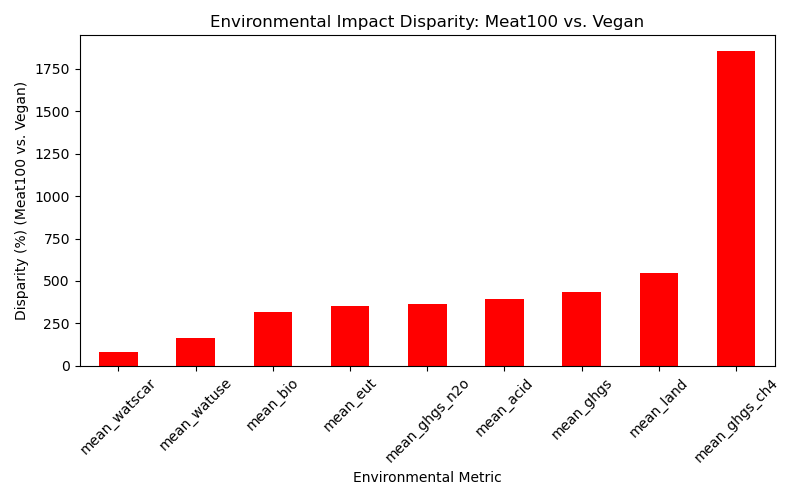

# data analysis and visualization
Author: Qinkun Zhong

Student number: 20702503

code link: https://github.com/AidanZhong/datavisualization

## Comparison of Environmental Impact by Diet Group (Average Values)

- Mean Acid / Acidification potential
  - Measures emissions that can cause acid rain, harming soil, forests, and aquatic systems.
  - The vegan is the best, and meat100 is the worst
- Mean Bio / biodiversity loss
  - For this metric, the vegan is the best, and meat100 is the worst
- Mean Eut / Eutrophication potential
  - Measures pollution that leads to excess nutrients (like nitrogen and phosphorus) in water bodies, causing algal blooms and dead zones.
  - The vegan is the best, and meat100 is the worst
- Mean Ghgs / greenhouse gas emissions
  - Average greenhouse gas emissions from food production.
  - The vegan is the best, meat100 is the worst
- Mean Ghgs Ch4
  - Average methane (CH₄) emissions.
  - The vegan is the best and meat100 is the worst
- Mean Ghgs N2O
  - Average nitrous oxide (N₂O) emissions
  - The vegan is the best, meat100 is the worst
- Mean Land
  - Average land use required for food production
  - The vegan cost the lowest, meat100 cost the highest
- Mean Watscar / Water scarcity
  - Measures how much water consumption contributes to water scarcity in stressed areas.
  - The vegan is the best, the meat100 is the worst
- Mean Watuse
  - Measures how much water is used for food production.
  - The vegan cost the lowest, meat100 cost the highest

Overall, the vegan is the best diet group and it is the best in every metric. And the meat100 is the worst in every metric.

## Disparity analysis

Disparity between meat100 and vegan diets (in %):

| term          | percentage  |
|---------------|-------------|
| mean_ghgs     | 434.090069  |
| mean_land     | 544.094684  |
| mean_watscar  | 79.407763   |
| mean_eut      | 352.352165  |
| mean_ghgs_ch4 | 1855.523862 |
| mean_ghgs_n2o | 366.701618  |
| mean_bio      | 315.817184  |
| mean_watuse   | 164.359303  |
| mean_acid     | 394.610207  |

We can tell that from greenhouse ch4, the meat100 cost 18 times more than vegan, which is a really significantly amount of greenhouse gas.
And even the lowest one - mean watscar, is also 80 percent more than vegan, all the other metric is more than 100 percent more.
It means the meat100 group will be doubly bad to environment than the vegan group